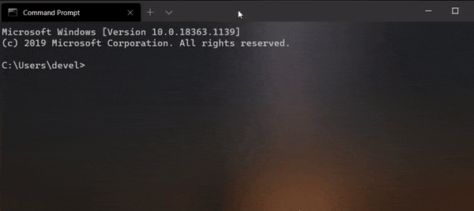

# Adb Over Wifi (aow)

[ /**a**-_o_/ ]

A command line tool written in `Rust` for adb to connect device over wifi.

I generally made this to satisfy my purpose _"to not use a cable when debugging app in Android studio"_. The tool is still in it's early stage & will be actively developed as this is my to-go program to quickly connect a device over wifi.

The program also verifies whether your device is connected over wifi or some similar checks with _Hints_ on how to fix them.

The usage of the program (after [installation](#Installation)) is pretty simple. Just connect a device > open a terminal & type `aow`. For more options read [here](https://github.com/KaustubhPatange/aow/wiki/Command-line-options).



## Installation

The program is available for all major platforms _**Mac, Linux & Windows**_ however the installation procedure might differ.

- [Windows](https://github.com/KaustubhPatange/aow/wiki/Installation/#windows-chocolatey)
- [Linux](https://github.com/KaustubhPatange/aow/wiki/Installation/#linux)
- [Mac](https://github.com/KaustubhPatange/aow/wiki/Installation/#mac)

## Contribute

Contributions are very welcome! See [CONTRIBUTING](CONTRIBUTING.md) for more info.

## License

- [The Apache License Version 2.0](https://www.apache.org/licenses/LICENSE-2.0.txt)

```
Copyright 2020 Kaustubh Patange

Licensed under the Apache License, Version 2.0 (the "License");
you may not use this file except in compliance with the License.
You may obtain a copy of the License at

   https://www.apache.org/licenses/LICENSE-2.0

Unless required by applicable law or agreed to in writing, software
distributed under the License is distributed on an "AS IS" BASIS,
WITHOUT WARRANTIES OR CONDITIONS OF ANY KIND, either express or implied.
See the License for the specific language governing permissions and
limitations under the License.
```
